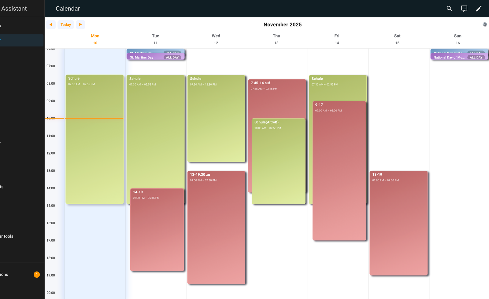
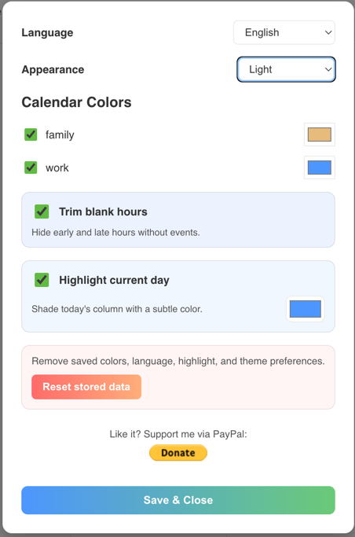

# Calendar Week Card

A a fully customizable Lovelace card that renders a weekly calendar grid for Home Assistant. The card discovers your calendars automatically and you can assign your preferred colors per calendar or change the main theme entirely.

### how it could look:



## Features
- Weekly grid layout with current time indicator
- Automatic calendar discovery with optional manual entity list
- Persistent calendar colors with built-in color picker
- Event details dialog
- Multilingual interface with browser or user-selected language


### Settings dialog

<br/>


## Installation
### HACS (recommended)

1. Ensure you are running Home Assistant 2023.5 or newer.
2. In HACS, add this repository as a custom repository of type **Lovelace**.
3. Install **Calendar Week Card** from the custom repositories list.
4. After installation, reload your Lovelace resources or restart Home Assistant if prompted.

### Manual installation

1. Add https://github.com/TheLuXoR/calendar-week-card to your custom HACS repositories
2. Search for "Calendar Week Card"
3. Download the latest release

## usage
currently the calendar card is meant to be used as a panel view.
#### how to do a panel view?
<details>

1. add a new dashboard
2. open the dashboard and open its settings
3. adjust it to Panel<br>
</details>

### Minimal setup
```yaml
type: custom:calendar-week-card
```

### manual setup with predefined Calendars
```yaml
type: custom:calendar-week-card
title: Family calendar
entities:
  - calendar.family
  - calendar.work
```
currently I set it up to work as a panel dashboard

- `title` (optional): Override the header text.
- `entities` (optional): Explicit list of calendar entities. When omitted, all available calendars are shown.
#### comming soon
- `colors` (optional): Map of entity IDs to hex color values. Values can also be adjusted from the card's settings dialog.

## Development

This repository uses a small build script to generate the necessary output files:

```bash
npm run build
```


## Support the project

you like it? you could support me =)</br>
[](https://www.paypal.com/donate/?hosted_button_id=ABUTP5VLEUBS4)

## License

This project is released under the MIT License.
